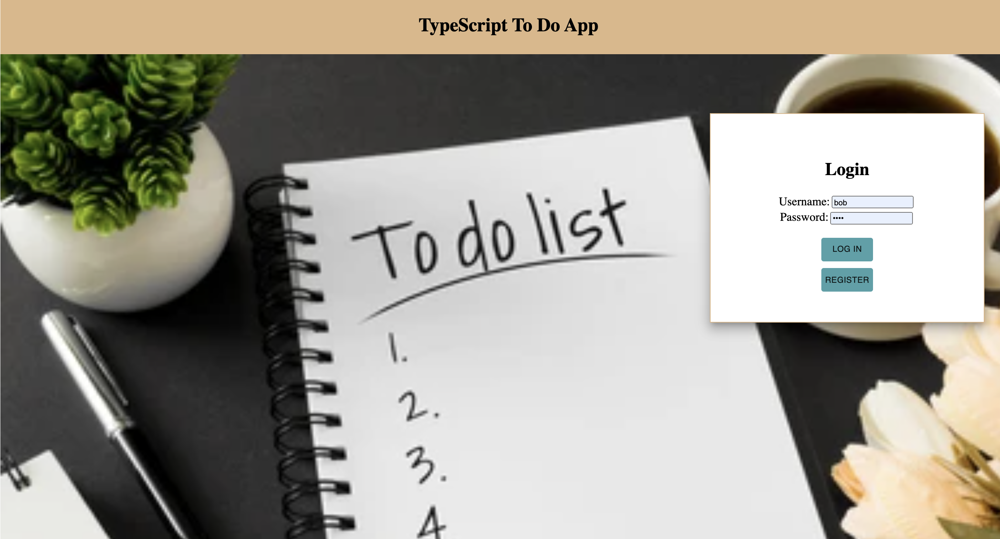
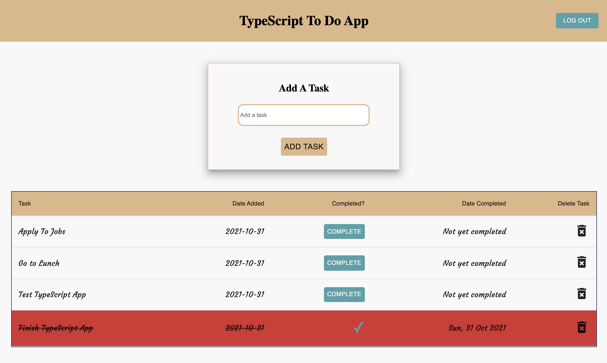

# TypeScript To-Do List

This is a to-do list built with TypeScript. The application has a login to allow for multiple users.
This application allows the user to add a task(Create), view the tasks(Read), update a task to complete(Update),
and delete a task(delete).

## Technologies used

- TypeScript
- React
- Redux
- Node
- Express
- PostgreSQL

## Photos

## To get started

- Create a PostgreSQL database named: typescript_to_do
- Create the tables provided in the Database.sql file
- git clone this repo
- npm install
- To start the application open two terminals. In the first enter npm run server. in the second enter npm run client
